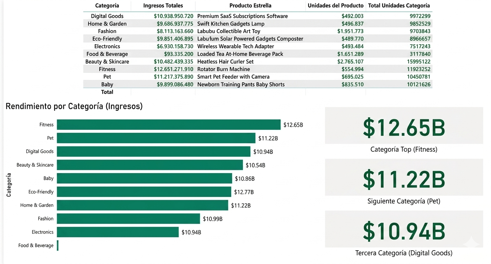

# Shopify E-Commerce Performance Analysis 

##  Contexto de Negocio 
Una empresa de comercio electrónico que opera dentro del ecosistema de Shopify solicitó un análisis de rendimiento de sus ventas del año 2025. El objetivo estratégico fue **identificar las categorías de mercado más lucrativas y el producto estrella de cada una de ellas**. 

Esta información es clave para la junta directiva, ya que les permitirá **saber con precisión dónde invertir el capital el siguiente año**, optimizando el presupuesto en inventario y pautas publicitarias hacia los nichos con mayor tracción financiera.

---

##  Arquitectura y Tecnologías Utilizadas:
El proyecto destaca por implementar una solución híbrida, aprovechando la potencia de cálculo de **SQL** para las agregaciones pesadas y la flexibilidad de **Pandas** para el modelado final de los datos:

* **Python & Pandas:** Lectura de la data cruda, procesamiento de nulos y ejecución de un cruce relacional de datos (`pd.merge`) junto con técnicas de limpieza de duplicados estratégicos (`.drop_duplicates`).
* **SQL (SQLite3 en Memoria):** Montaje de una base de datos relacional temporal para ejecutar consultas estructuradas utilizando funciones de agregación (`SUM`) y agrupamientos complejos (`GROUP BY`).
* **Power BI:** Conexión del set de datos procesado para el diseño de la matriz analítica ejecutiva y gráficos de distribución de ingresos.

---

##  Código y Lógica de Negocio:
El core del análisis se estructuró dividiendo el problema en dos consultas SQL independientes que luego son unificadas en el pipeline de Python:

1. **Rendimiento por Categoría:** Cálculo del total de unidades vendidas y el ingreso estimado acumulado en USD por cada sector comercial.
2. **Identificación de Productos Líderes:** Agrupación por volumen de ventas a nivel de producto individual.
3. **Fusión e Inteligencia de Datos:** Implementación de un `INNER JOIN` lógico en Pandas para amarrar cada categoría con su producto más demandado, formateando los resultados numéricos a una escala legible de negocio (Millones `$M` / Unidades).

---

##  Visualización del Reporte Ejecutivo:
A continuación, se presenta la matriz de rendimiento detallada y el gráfico de barras horizontales que consolida los ingresos estimados:

###  Hallazgos Clave Extraídos del Script:
* **Liderazgo de Inversión:** La categoría **Fitness** es la prioridad absoluta para el presupuesto del próximo año, generando más de $12,651 Millones en ingresos, apalancada por su producto estrella: *Rotator Burn Machine*.
* **Nichos de Alta Tracción:** Sectores como **Pet** y **Digital Goods** demuestran una altísima rentabilidad, facturando por encima de los $10,900 Millones cada uno, lo que los convierte en opciones seguras para expandir el catálogo.
* **Punto de Alerta Financiera:** La categoría **Food & Beverage** reportó ingresos sumamente bajos ($93.53 Millones). El análisis sugiere detener o reevaluar la inversión en este sector, ya que el retorno de inversión actual no justifica la asignación de presupuesto para el siguiente año